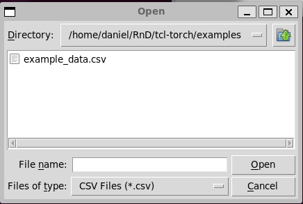

# README for TCL-Torch Project

## Overview
TCL-Torch is an interactive neural network training and visualization tool designed for simplicity and ease of use. It offers a streamlined approach to training neural networks on 1D data. Its user interface allows users to upload data in CSV format, design neural network architectures, and train networks without requiring in-depth programming knowledge. Key features include CSV data upload, neural network architecture customization (including neurons per layer and number of layers), training on user-provided data, and immediate visual feedback on the training results. Note that currently, TCL-Torch operates without GPU support and does not include logging features, making it best suited for small datasets and simpler architectures.

## System Requirements
This system installation has only been tested on the following system. 
- Ubuntu 22.04.2 LTS (Windows WSL Distribution)
- Python 3.10.12

## Installation
1. **Install TCL Prerequisites**: 
   - Run `sudo apt install tcl tk tcllib` in your terminal.

2. **Install Python Dependencies**: 
   - Dependencies are listed in `python/requirements.txt`. Install them using pip.

3. **Set Environment Variables**: 
   - Run `source ./setup-environment.sh` to set `TCLLIBPATH`.
   - This needs to be done for each new terminal session or you can set it permanently in `.bashrc`.

## Getting Started
### 1. **Initial Screen**:

   - Upon starting the program, you'll be greeted with the **Start Screen**.
   - Click "Verify Python Installation" to ensure all required packages are installed.
   - Then click "Start Program" to begin.

### 2. **Function Selection**:
   - You'll then see the **Function Select** screen.
   - Click on "Fit1D Data" to proceed.

### 3. **Data Upload**:

   - Click "Upload CSV" to upload your data file.
   - Data should be in CSV format with two columns, each having a header.
   - You can use your own CSV or an example from the `example` directory.
### 3. **View CSV**:

   - Verify the uploaded data using "View Uploaded CSV".

### 4. **Design Neural Network**:

   - Click on "Design Neural Network Architecture".
   - Set parameters such as neurons per layer, number of layers, learning rate, number of epochs, and input data.
   - Note: GPU usage is currently disabled.

### 5. **Train Neural Network and View Results**:

   - After designing the architecture, click on "Train Neural Network".
   - Select one of the neural networks and click "Train and Predict on Data".
   - Training is quick with default settings but may vary with larger datasets or complex architectures.
   - Post-training, a visual representation of the original data and the neural network fit will be displayed.
   - The fit and weights are saved in the `resources/nn_models/{your model name}` directory.

## Notes
- The tool currently does not support logging, so it's recommended to use smaller datasets and simpler network architectures for quicker results.
- Randomness in training may lead to variations in results.
